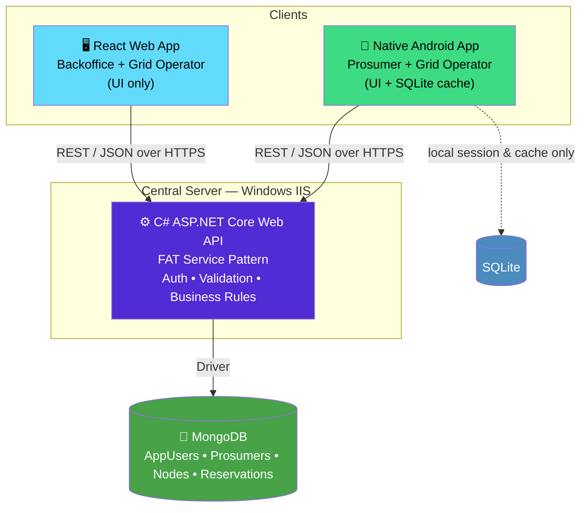
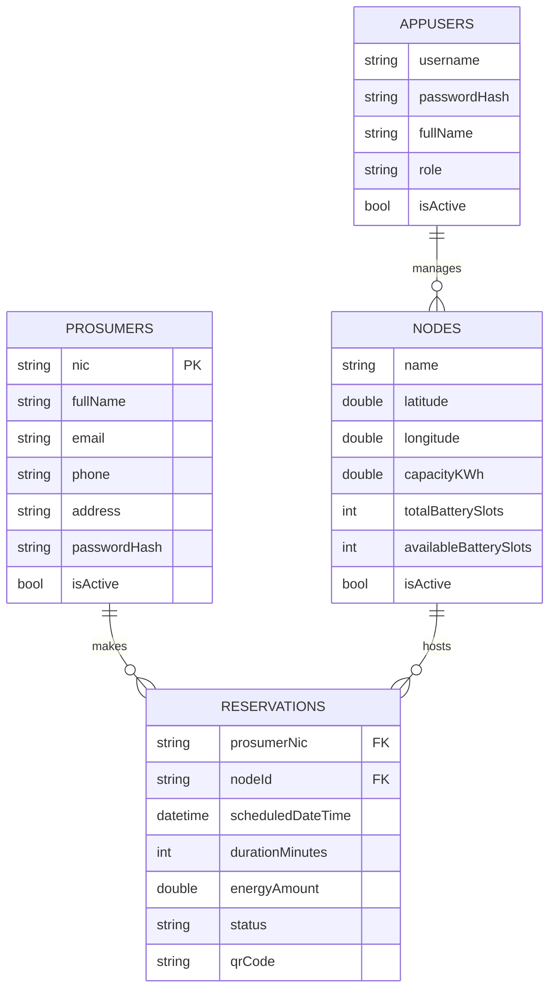

<div align="center">


<br/>

[](https://dotnet.microsoft.com/)
[](https://react.dev/)
[](https://developer.android.com/)
[](https://www.mongodb.com/)
[](https://www.iis.net/)

[]()
[]()
[]()
[]()

**An end-to-end client-server platform where solar prosumers trade energy on a microgrid — a React back-office, a pure-native Android app, and a FAT C# Web API backed by MongoDB.**

[Overview](#-overview) • [Architecture](#-architecture) • [Features](#-features) • [Tech Stack](#-tech-stack) • [Getting Started](#-getting-started) • [API Reference](#-api-reference) • [Team](#-team--individual-contributions) • [Roadmap](#-known-limitations--pre-submission-todo)

</div>

<br/>

## 📖 Overview

The **Smart Solar Microgrid Trading System** connects three kinds of people around a network of solar microgrid hubs ("nodes"):

| Role | Where they work | What they do |
|---|---|---|
| 🏢 **Backoffice** | Web app | Manage users, prosumers, microgrid nodes, and oversee all reservations |
| ⚡ **Grid Operator** | Web app **+** Android app | Monitor bookings, manage node battery-slot availability, verify energy-transfer QR codes on-site |
| ☀️ **Prosumer** | Android app | Register with their NIC, book/modify/cancel energy slots, track history, and view nearby nodes on a map |

Every client is intentionally a **thin UI layer**. Authentication, validation, the 7-day booking window, the 12-hour modification/cancellation rule, and every database write live in one place — the central **FAT Web API**.

<br/>

## 🏗️ Architecture



**Golden rule:** neither client ever talks to MongoDB directly. SQLite on Android is a local cache (session token, profile snapshot, station list) — MongoDB via the API is always the source of truth.

<details>
<summary><strong>📁 Repository structure</strong></summary>

```
Smart-Solar-Microgrid-Trading-System/
├── web-service/
│   ├── SolarGrid.Api/          # ASP.NET Core Web API (Controllers → Services → Repositories)
│   └── SolarGrid.Tests/        # Unit tests
├── Frontend/                   # React + Vite + Tailwind/Bootstrap web app
│   └── src/
│       ├── pages/              # Dashboard, Nodes, Prosumers, Reservations, Users, Login
│       ├── components/         # ProtectedRoute, Sidebar, UI widgets
│       ├── context/            # AuthContext
│       └── api/                # Axios client
├── android/
│   └── app/src/main/java/com/team/smartsolar/
│       ├── database/            # SQLiteOpenHelper (DatabaseHelper)
│       ├── network/              # Retrofit client + API interface
│       ├── models/               # DTOs
│       └── *Activity.java        # Login, Register, Dashboard, Booking, Profile, Maps...
├── SETUP.md                    # Full local + IIS hosting guide
└── README.md                   # You are here
```
</details>

<br/>

## ✨ Features

<table>
<tr>
<td valign="top" width="33%">

### 🏢 Backoffice (Web)
- Create/manage Backoffice & Grid Operator accounts
- Create, update, deactivate microgrid nodes
- GPS location, capacity (kW/h), battery slots
- Review, activate & reactivate prosumers
- Live analytics dashboard (today / 7-day / month)
- Full reservation oversight

</td>
<td valign="top" width="33%">

### ⚡ Grid Operator (Web + Android)
- Monitor active/pending bookings
- Update battery slot availability
- Web-side reservation management
- 🚧 *Mobile QR scan & verify — in progress*
- 🚧 *Nearby-station map on mobile — in progress*

</td>
<td valign="top" width="33%">

### ☀️ Prosumer (Android)
- Register & log in with NIC
- Edit profile, request deactivation
- Reserve, modify, cancel energy slots
- 7-day booking window enforced
- 12-hour modify/cancel notice enforced
- View nearby nodes on Google Maps
- Booking history, pending bookings, dashboard counts
- QR code generated on approval

</td>
</tr>
</table>

<br/>

## 🛠️ Tech Stack

| Layer | Technology |
|---|---|
| **Central Web Service** | C# · ASP.NET Core 8 Web API · FAT Service pattern · hosted on Windows IIS |
| **Database** | MongoDB (NoSQL) — `AppUsers`, `Prosumers`, `Nodes`, `Reservations` collections |
| **Web Client** | React 19 · Vite · Tailwind CSS 4 · Bootstrap 5 · React Router · Recharts · Axios |
| **Mobile Client** | Native Android (Java) · XML layouts · SQLiteOpenHelper · Retrofit · Google Maps SDK |
| **Testing** | xUnit (SolarGrid.Tests) |
| **Version Control** | Git / GitHub — feature branches, PR-based merges |

<br/>

## 🚀 Getting Started

> Full step-by-step instructions — including the exact **IIS hosting walkthrough** — are in **[`SETUP.md`](./SETUP.md)**. Quick start below.

<details>
<summary><strong>⚙️ 1. Central Web API</strong></summary>

```bash
cd web-service/SolarGrid.Api
dotnet user-secrets set "SolarGridDatabase:ConnectionString" "<your-mongodb-connection-string>"
dotnet run
```
Swagger UI opens automatically at `https://localhost:8080/swagger` (or the port shown in your terminal).

</details>

<details>
<summary><strong>🖥️ 2. React Web App</strong></summary>

```bash
cd Frontend
npm install
npm run dev
```
Runs at `http://localhost:5173` — make sure the API base URL in `src/api/axiosClient.js` points at your running API.

</details>

<details>
<summary><strong>📱 3. Android App</strong></summary>

1. Open the `android/` folder in Android Studio.
2. Update the base URL in `network/RetrofitClient.java` to your host machine's **LAN IP** (not `localhost`) if testing on a physical device or a networked emulator.
3. Add your Google Maps API key where the manifest expects it.
4. Run on an emulator or device.

</details>

<details>
<summary><strong>🌐 4. Hosting on IIS (production)</strong></summary>

See **[`SETUP.md`](./SETUP.md#4-how-to-host-on-windows-iis-production)** for the full walkthrough: hosting bundle, publish script, IIS site + app pool configuration, and the `C:\inetpub\wwwroot` permissions fix.

</details>

<br/>

## 📡 API Reference

<details>
<summary><strong>Click to expand the endpoint catalogue</strong></summary>

| Area | Endpoint | Purpose |
|---|---|---|
| Auth | `POST /api/auth/login` | Backoffice / Grid Operator login |
| Users | `GET/POST /api/users` | List / create Backoffice & Grid Operator accounts |
| Users | `PUT /api/users/{id}` · `PATCH /api/users/{id}/deactivate` | Update / deactivate an account |
| Prosumers | `GET/POST /api/prosumers` | List / register prosumers (NIC-keyed) |
| Prosumers | `GET/PUT /api/prosumers/{nic}` | View / edit a profile |
| Prosumers | `PATCH /api/prosumers/{nic}/deactivate` · `/reactivate` | Deactivate / Backoffice-only reactivate |
| Nodes | `GET/POST /api/nodes` | List / create microgrid nodes |
| Nodes | `PUT /api/nodes/{id}` · `PATCH /api/nodes/{id}/deactivate` | Update / deactivate a node |
| Reservations | `GET /api/reservations` · `GET /api/reservations/prosumer/{nic}` | List all / by prosumer |
| Reservations | `POST /api/reservations` | Create (7-day rule enforced) |
| Reservations | `PUT /api/reservations/{id}` | Modify (12-hour rule enforced) |
| Reservations | `PATCH /api/reservations/{id}/cancel` | Cancel (12-hour rule enforced) |
| Reservations | `PATCH /api/reservations/{id}/approve` | Approve — issues a QR code |
| Reservations | `PATCH /api/reservations/{id}/complete` | Mark a transfer complete |
| Dashboard | `GET /api/dashboard?period=all\|today\|7d\|month` | Live analytics |

Full interactive docs are always available at `/swagger` once the API is running.
</details>

<br/>

## 🗄️ Database Design



> **Design note:** the marking scheme names a fourth collection, `EnergyBookingSlots`, as time/capacity inventory separate from station info. This implementation folds slot capacity directly into `Nodes` (`totalBatterySlots` / `availableBatterySlots`) instead of a separate collection — call this out explicitly as a documented design decision in the report.

<br/>

## 👥 Team & Individual Contributions

<div align="center">

| Member | Primary Ownership | Commits |
|---|---|:---:|
| **Nithika** ([@NIKKAvRULZ](https://github.com/NIKKAvRULZ)) |Mobile Application — Prosumer Core (Android UI/UX layouts, SQLite persistence, booking workflows, dashboard metrics, QR generation) |  |
| **Sasmitha Kavindu** ([@sasmithaK](https://github.com/sasmithaK)) | Central Web Service + Mobile Hardware (C# API, MongoDB, IIS hosting, API business rules, Android Maps integration, Operator QR scanning) |  |
| **Hiruni Chamathka** ([@chamahiru](https://github.com/chamahiru)) | Web Application & QA (React Backoffice UI, user/prosumer/node management, API integration, API edge-case testing) |  |
| **Desima Weerasinghe** ([@DesimaW](https://github.com/DesimaW)) | Web Application & Docs (React Grid Operator UI, slot/booking UI, leading Project Report and Demo Video production) |  |

</div>

> Commit counts above are from `git shortlog -sne` on this repository and are meant as a starting point — the **report's individual-contribution section** should describe *what* each person built, the design decisions they made, any AI tools used during planning (per the module's Level 2 — AI Planning policy), and the challenges they hit.

<br/>

## 🎥 Demo Video

📺 **[Watch the demo video](#)** *(replace this link with your YouTube/OneDrive video — required in the submission, ≤5 minutes)*

<br/>

## ✅ Known Limitations / Pre-Submission TODO

> An honest running list — use this as your team's final punch-list before the 30th. Nothing here is a criticism of the work done so far; the core architecture is solid.

- [ ] **Add a header comment block to every `.cs` file and an inline comment at the start of every method.** The brief states code without these *will not be marked* — this applies to every file under `web-service/SolarGrid.Api`.
- [ ] **Enforce authentication & role-based authorization server-side.** No `[Authorize]` attributes or auth middleware currently exist — every endpoint is open. Add a real auth scheme (JWT bearer is the natural upgrade from today's placeholder GUID token) and lock down Backoffice-only / Grid-Operator-only endpoints.
- [ ] **Fix mobile Prosumer registration.** `RegisterActivity` currently posts to `/api/users` (the Backoffice/Grid-Operator collection) with role hard-coded to `"Prosumer"`. It should call `POST /api/prosumers` so the record lands in the `Prosumers` collection keyed by NIC — otherwise profile, deactivation and reservation lookups for that account will 404.
- [ ] **Add a dedicated Prosumer login endpoint** (e.g. `POST /api/prosumers/login`), separate from the Backoffice/Grid-Operator `/api/auth/login`.
- [ ] **Block node deactivation when active reservations exist** — currently `DeactivateAsync` flips the node inactive unconditionally.
- [ ] **Add real server-side QR verification.** `PATCH /api/reservations/{id}/complete` doesn't take or check a scanned payload today; add a `verify-qr` endpoint that validates the token/hash before allowing completion.
- [ ] **Build the Grid Operator mode on Android** — QR scanner activity, server verification call, completion confirmation, and a nearby-stations map view for the operator role.
- [ ] Replace the hard-coded `"Welcome, Nithika"` greeting in `DashboardActivity` with the logged-in user's real name.
- [ ] Remove `Frontend/dist/` and `.vs/` from version control (already in `.gitignore`, but a few files were committed before that took effect) — `git rm -r --cached Frontend/dist .vs`.
- [ ] Capture unique screenshots of every screen, and the opening/login screen, for the report and the submission ZIP.
- [ ] Paste all source code as text (not screenshots) into the report appendix, per the brief.

<br/>

## 📚 Documentation

- [`SETUP.md`](./SETUP.md) — full local dev + IIS hosting guide
- Project report — architecture diagram, use case diagram, DFD, database design, business rules, testing, and individual contributions (submitted separately per the assignment brief)

<br/>

## 📄 License

Built for **SE4040 — Enterprise Application Development**, BSc (Hons) IT (Software Engineering), Faculty of Computing. Academic project — not licensed for commercial use.

<br/>

<div align="center">

**Made with ☀️ by Nithika, Hiruni, Desima & Sasmitha**


</div>
